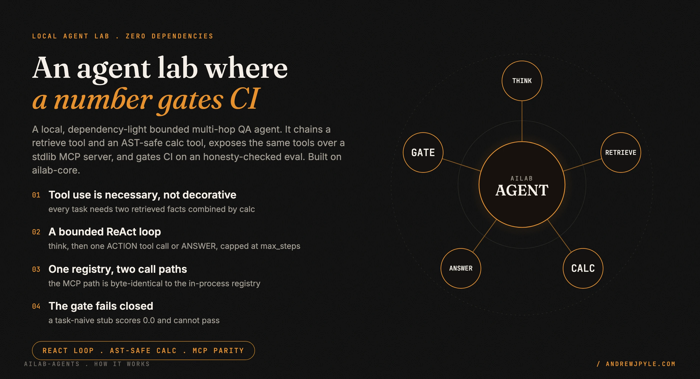
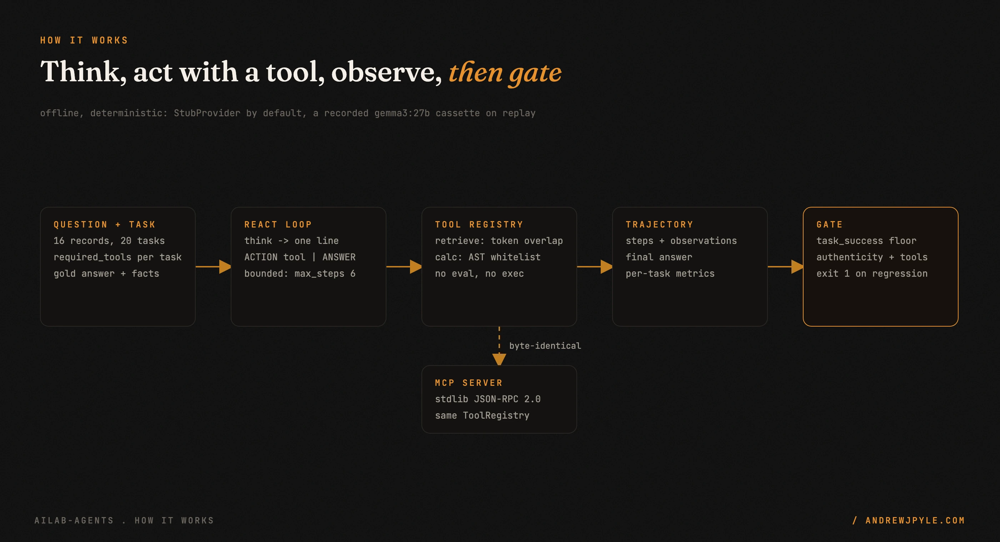
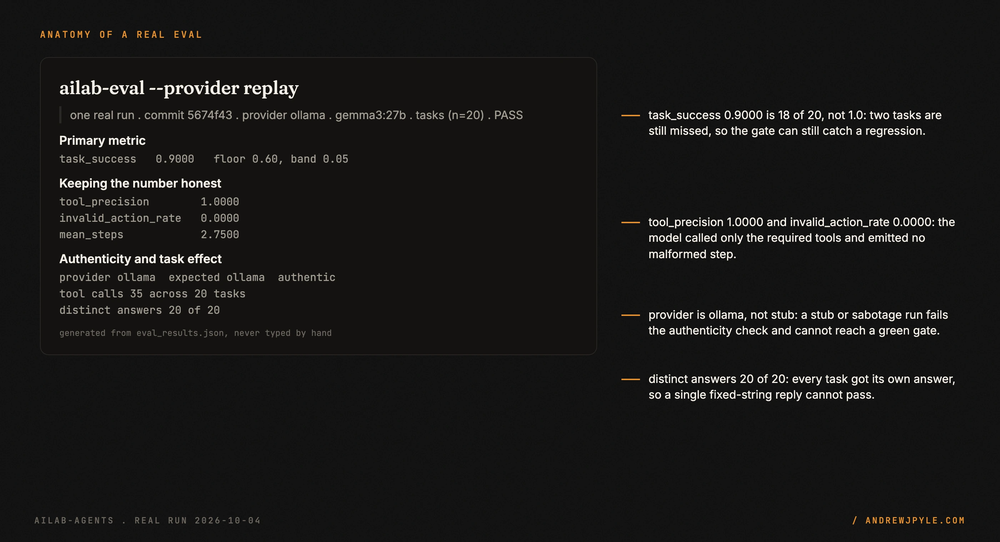
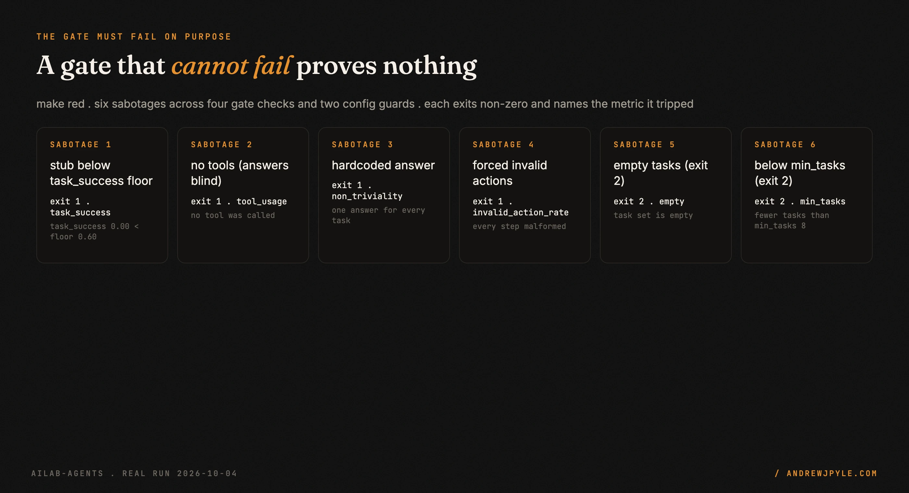

<p align="center">
  
</p>

<p align="center">
  <a href="https://github.com/andrewjpyle/ailab-agents/actions/workflows/ci.yml"></a>
  
  
</p>

# ailab-agents

A small, local, open-source lab for a bounded, tool-using agent, where **a number gates CI**. It
builds a ReAct-style agent that must chain a `retrieve` tool and an AST-safe `calc` tool to answer,
scores whether it got the answer AND used the tools, and a tolerance-band regression gate fails the
build when the agent regresses. The same tools are exposed over a tiny stdlib MCP server, and a
parity test proves the two call paths cannot drift. You learn the concepts by running them: change
one input, re-run, and watch the trajectory and the metric move.

- **Tool use is necessary, not decorative.** Every multi-hop task is answerable only by retrieving two facts and combining them with `calc`. An agent that does not chain the tools cannot pass.
- **A gate you can trust because you watched it fail.** `make red` fires six sabotages and each one must exit non-zero and name the metric it tripped.
- **One registry, two call paths.** The agent and the MCP server share one `ToolRegistry`, and a parity test asserts the MCP results are byte-identical to the in-process calls.
- **Safe calc.** The `calc` tool uses an AST whitelist, never `eval` or `exec`. A red test proves `__import__("os")` and attribute-access payloads raise.
- **Offline and reproducible.** A stub brain by default and a recorded `gemma3:27b` cassette on replay. No network and no key to run the eval.

> **The one idea worth stealing, even if you never run this code:** a passing score is not a
> passing agent. This lab's gate refuses a run that scores by luck, that echoes one fixed answer,
> or that never calls a tool, and it refuses any provider that is not the recorded real model. A
> green gate here means the agent did the work, with the tools, as itself, and you can prove the
> gate goes red when any of that is false.

---

## How it works

<p align="center"></p>

The corpus and the tasks are loaded, a `ToolRegistry` is built (a `retrieve` tool over the corpus
plus the `calc` tool), and the bounded agent runs each task. The agent is a bounded ReAct loop
(`max_steps` 6): each step it sees the question, the tool list and the observation history, then
emits one line, `ACTION: <tool> <arg>` to call a tool or `ANSWER: <text>` to stop. A malformed line
is an invalid action, counted and bounded. Per-task metrics are aggregated, and the gate checks them
against explicit floors with a tolerance band, plus authenticity, tool-usage and non-triviality
checks. A regression exits `1` and CI fails.

The brain runs behind an `LLMProvider` seam imported from `ailab-core`. `StubProvider` is a
deterministic, offline format path, not a real model. `ReplayProvider` serves a committed JSON
cassette keyed by `sha256(model, prompt)`, recorded once from a real `gemma3:27b` (`make record`,
opt-in). A cassette miss raises, so a stale cassette cannot silently pass. Nothing in the default
path touches the network.

| Path | What lives there |
|---|---|
| `src/ailab_agents/data.py` | Corpus and task loaders, dataset sha256 |
| `src/ailab_agents/tools.py` | `Tool` protocol, `RetrieveTool`, `CalcTool` (AST whitelist), `ToolRegistry` |
| `src/ailab_agents/agent.py` | Bounded ReAct loop, action parser, `Trajectory` |
| `src/ailab_agents/metrics.py` | task_success, tool_precision, invalid_action_rate, normalize_answer |
| `src/ailab_agents/providers.py` | `LLMProvider`, `StubProvider`, `ReplayProvider`, `OllamaProvider` |
| `src/ailab_agents/eval.py` | Runner and regression gate (`ailab-eval`) |
| `src/ailab_agents/mcp_server.py` | Stdlib JSON-RPC MCP server over the same registry |
| `src/ailab_agents/compare.py` | Diff two saved runs (one changed variable) |
| `fixtures/` | Synthetic data only; provenance in [FIXTURES.md](FIXTURES.md) |

It keeps **no third-party runtime dependencies**: the tools and the MCP server are pure stdlib,
and the live provider uses `urllib`. It has one pinned first-party dependency, `ailab-core`,
referenced by an immutable commit SHA for the provider seam and the gate primitives. `ruff`, `mypy`
and `pytest` are dev-only. It is scaffolded from `ailab-template-python` and ports its wiring from
`ailab-rag` (SHAs in [`BUILD_SOURCES.txt`](BUILD_SOURCES.txt) and [docs/DESIGN.md](docs/DESIGN.md)).

## The eval

The primary metric is `task_success`: did the agent's final answer match the gold answer, after
normalisation. Three more metrics and three honesty checks keep that number honest.

<p align="center"></p>

Replaying the committed real `gemma3:27b` cassette passes the gate. The model chains `retrieve` then
`calc` and reaches the right answer on **18 of 20 tasks (`task_success` 0.90)**, with
`tool_precision` 1.0 and `invalid_action_rate` 0.0. It is not saturated: two tasks are still missed,
so the gate can still detect a regression. This is the committed `eval_results.json`, reproduced
offline from the cassette:

```text
| Date | Commit | Provider | Dataset | max_steps | task_success | tool_precision | invalid_rate | mean_steps | Notes |
|---|---|---|---|---|---|---|---|---|---|
| 2026-10-04 | 5674f43 | ollama | tasks (n=20) | 6 | 0.9000 | 1.0000 | 0.0000 | 2.7500 | PASS |
authenticity: provider=ollama expected=ollama -> ok
tool usage: total_tool_calls=35 no_tools_mode=False
non-triviality: distinct_answers=20 answered_n=20
metrics: task_success=0.9000 tool_precision=1.0000 invalid_rate=0.0000 mean_steps=2.7500 (n=20)
```

Reproduce it offline with:

```bash
uv run ailab-eval --provider replay --cassette fixtures/cassettes/agent_gemma3_27b.json --model gemma3:27b
```

By default `make eval` runs the offline STUB brain, which is task-naive on purpose: it retrieves
once and answers with the raw text instead of doing the arithmetic. So it scores `task_success`
0.0, fails the authenticity check, and fails the gate. That is the point: the gate fails closed on
an agent that did not do the work.

| Metric or check | What it catches |
|---|---|
| `task_success` | the agent did not reach the right answer |
| `tool_precision` | the agent used tools outside the task's required set |
| `invalid_action_rate` | the agent emitted malformed, unparseable steps |
| `mean_steps` | a degenerate loop (surfaced, not gated) |
| authenticity | the provider is a stub or sabotage, not the recorded real model |
| tool usage | the agent answered without calling any tool |
| non-triviality | the agent returned one fixed answer regardless of the task |

`make demo` shows the agent's steps on a couple of tasks first, so you can watch a retrieval, the
answer it stops on, and why the task-naive stub misses:

```text
corpus: 16 records, 20 tasks, tools=['retrieve', 'calc'], max_steps=6

Task [t01]: What is the combined crew of Halcyon Ridge Station and Vesper Hollow Station?
    required_tools=['retrieve', 'calc'] gold=79
    step 1: ACTION retrieve What is the combined crew of Halcyon Ridge Station ...
    step 2: ANSWER Halcyon Ridge Station was commissioned in 2131. It carries a crew of 42 ...
    final: '...' -> MISS (stopped=answered)
```

## Proof of gate

A passing gate is only worth something if it could have failed. `make red` breaks the agent six
ways on purpose, and each one must exit non-zero and name the metric it tripped. If any sabotage
slips through, `make red` itself fails.

<p align="center"></p>

```text
== make red: proving the gate fails on each sabotage ==
PASS [1 stub below task_success floor]: exit 1, named 'task_success'
PASS [2 no tools (answers blind)]: exit 1, named 'tool_usage'
PASS [3 hardcoded answer]: exit 1, named 'non_triviality'
PASS [4 forced invalid actions]: exit 1, named 'invalid_action_rate'
PASS [5 empty tasks (exit 2)]: exit 2, named 'empty'
PASS [6 below min_tasks (exit 2)]: exit 2, named 'min_tasks'
== all red cases failed the gate as required ==
```

Four of the six break a gate check (the score floor, tool usage, non-triviality, and the invalid
action rate), and two break a config guard (an empty task set and a set below `min_tasks`), which
exit `2` rather than `1`.

## Quickstart

```bash
make install    # uv sync --locked (Python 3.12, dev tools included)
make demo       # show the agent's steps on a couple of tasks, then run the eval
make eval       # score the agent, write eval_results.json, enforce the gate
make red        # prove the gate FAILS on each sabotage
```

The default `make eval` runs the stub brain and exits `1`, by design. A green eval needs the real
recorded model; see [Recording the cassette](#recording-the-cassette).

### Make targets

```bash
make lint       # ruff check, ruff format --check, mypy --strict
make test       # pytest with branch coverage (fails under 90%)
make mcp        # list the tools over a real MCP stdio round-trip
make compare    # diff two saved runs that change ONE variable
make record     # record the real-model cassette (needs OLLAMA_HOST; opt-in)
make lint-docs  # fail on an em dash (U+2014) in docs/ or *.md
make check-learning-numbers  # assert docs/LEARNING.md figures match the results
make scan       # gitleaks over full history + denylist scan

docker compose up   # build the image and run the demo in a container
```

### Configure it

Configuration is layered: defaults, then `eval_config.toml`, then environment variables, then CLI
flags. `ailab-eval` exits `0` when the gate passes, `1` on a regression (a metric outside its band,
no tool use, no task effect, too many invalid actions, or a non-authentic provider), and `2` on a
bad config or dataset (empty tasks, or fewer than `min_tasks`).

| Variable | Default | Purpose |
|---|---|---|
| `AILAB_CORPUS` | `fixtures/corpus.jsonl` | Corpus JSONL (`{"id","text"}`) |
| `AILAB_TASKS` | `fixtures/tasks.jsonl` | Tasks JSONL (`{"id","question","answer","required_tools","gold_facts"}`) |
| `AILAB_PROVIDER` | `stub` | `stub` or `replay` |
| `AILAB_MODEL` | `gemma3:27b` | Recorded model id to replay |
| `AILAB_MAX_STEPS` | `6` | Bounded loop: steps per task |
| `AILAB_TOLERANCE` | `0.05` | Gate band below each floor |
| `AILAB_INVALID_ACTION_MAX` | `0.20` | Max fraction of malformed steps |
| `AILAB_MIN_TASKS` | `8` | Fail (exit 2) below this many tasks |
| `AILAB_OUTPUT` | `eval_results.json` | Results file |

`eval_results.json` keeps the template's versioned shape (`schema_version: 1`). These top-level
keys are always present; the agent fields (authenticity, tool_usage, non_triviality, config, shas)
are diagnostic extras.

```json
{
  "schema_version": 1,
  "lab": "ailab-agents",
  "dataset": "tasks",
  "provider": "ollama",
  "model": "gemma3:27b",
  "primary_metric": "task_success",
  "metrics": {"task_success": 0.9, "tool_precision": 1.0, "invalid_action_rate": 0.0, "mean_steps": 2.75, "n": 20},
  "threshold": 0.6,
  "passed": true,
  "commit": "<full git sha, or null>",
  "generated_at": "2026-10-04T00:00:00Z"
}
```

## The MCP server

The same tools are exposed over a tiny stdlib JSON-RPC 2.0 server on stdio, with three methods:
`initialize`, `tools/list`, `tools/call`. It reads one JSON request per line and writes one JSON
response per line. No resources, prompts, notifications or network.

```bash
printf '%s\n' '{"jsonrpc":"2.0","id":1,"method":"tools/call","params":{"name":"calc","arguments":{"input":"42+37"}}}' \
  | uv run python -m ailab_agents.mcp_server
# -> {"jsonrpc": "2.0", "id": 1, "result": {"content": [{"type": "text", "text": "79"}]}}
```

`tests/test_mcp_parity.py` proves the MCP path returns results byte-identical to the in-process
`ToolRegistry.call(...)` for every tool across every task argument, because both paths dispatch
through the one registry.

## Recording the cassette

The default stub cannot pass the gate. A green eval needs a real recorded model:

```bash
OLLAMA_HOST=http://<host>:11434 AILAB_RECORD_MODEL=gemma3:27b make record
uv run ailab-eval --provider replay --cassette fixtures/cassettes/agent_gemma3_27b.json --model gemma3:27b
```

`make record` drives the SAME bounded loop with a local Ollama model and writes a cassette keyed by
`sha256(model, prompt)`. The host address comes from `OLLAMA_HOST` and is never written to disk; a
scan refuses to write if any host, IP or local path leaked into a response. This step is
operator-gated and is not part of v1's committed data.

## Scope: what it does not do

- **The committed smoke cassette is a stub, not a real model.** `fixtures/cassettes/agent.json` is a format recording for offline tests; its header says `provider: stub`, so replaying it can never pass the authenticity gate. The real pass uses `agent_gemma3_27b.json`.
- **The stub brain does not reason.** It retrieves once and echoes the text. A real model is needed to chain retrieve then calc.
- **No live LLM in CI.** The real model is recorded once and replayed. A live call is opt-in and local.
- **The data is synthetic.** The 16 research stations are invented. The numbers describe this lab, not any real agent.
- **Two tools, one loop.** No planner, no reflection, no parallel calls, no multi-agent orchestration. Those are later slices behind the seam.

## The patterns

| Pattern | The failure it prevents |
|---|---|
| Prove the gate can fail (`make red`) | a green check that was never able to go red |
| Authenticity check | a stub or sabotage run passing as the real model |
| Tool-usage and non-triviality checks | a score reached by luck, or one fixed answer for every task |
| Tolerance band, not an exact score | a gate that flaps on one noisy example |
| One registry, a parity test | the agent path and the MCP path drifting apart |
| AST whitelist, never `eval` or `exec` | a calc tool that runs arbitrary code |
| Record and replay the real model | a flaky, paid, networked CI run |
| Numbers generated from results, never typed | a hand-edited figure that drifts from the data |

## Privacy and the secret wall

The data is synthetic (invented research stations) and carries no real product, support, or
personal data. Everything runs locally. The secret wall runs on every push:

1. **gitleaks** with [`.gitleaks.toml`](.gitleaks.toml), run by the `pre-push` hook (`make hooks`) and the CI `secret-scan` job, over the full history.
2. **Denylist scan** ([`scripts/denylist_scan.sh`](scripts/denylist_scan.sh)): generic public patterns are committed; private patterns come from a secret or local file and are never committed or printed. The scan fails closed.

`OLLAMA_HOST` is runtime-only, read from the environment, and never written to a committed file.

See [MODEL_CARD.md](MODEL_CARD.md) for what the numbers do and do not mean, and
[docs/LEARNING.md](docs/LEARNING.md) for the concepts, each tied to a real number from this lab.

## License

[Apache License 2.0](LICENSE). Copyright 2026 Andrew Pyle.
